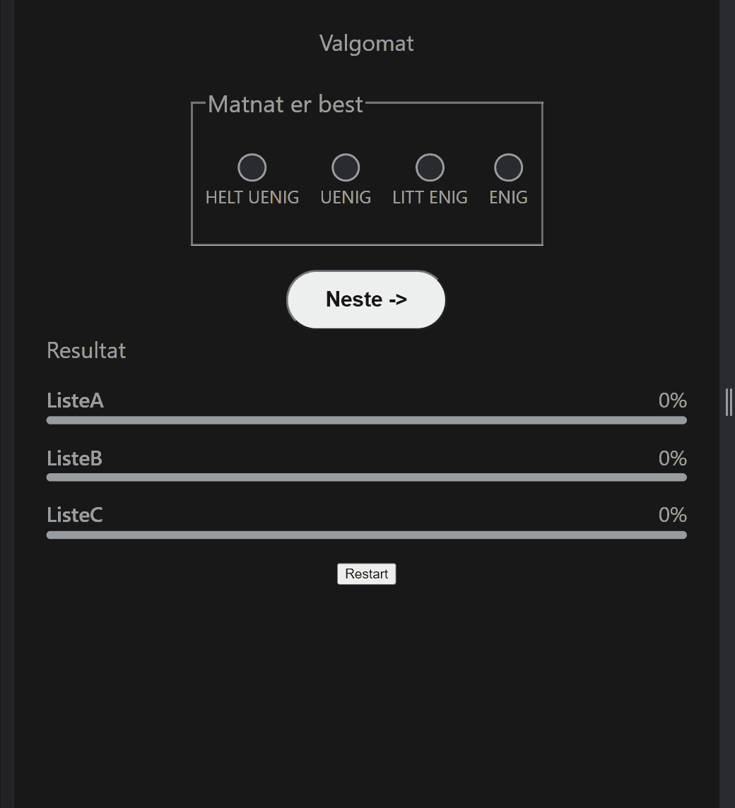

# Studentparlamentet Valgomat

Enkel valgomat for studenparlamentet på UiB laget av friByte.

## Grunnlag

Studentparlamentet på UiB ønsker å utvikle en valgomat for å øke interessen rundt studentvalget som foregår hvert år.

Valgomaten er basert på NRK valgomat sin mattematik som ligger åpen tilgjengelig på Github https://github.com/nrkno/valg-valgomat-algoritme. For å lese mer om hvordan NRK har implementert sin valgomat se https://nrkbeta.no/2019/07/03/slik-snekret-vi-en-valgomat-for-hele-landet/.

## Krav

- [x] Infoboks om valgomaten
- [x] Kunne deploye valgomaten inni for eksempel en wordpress side
- [x] Lett kunne bytte ut spørsmål og svar på valgomaten neste år
- [x] Vise en lett oversikt over hvor enig man er med hver liste
- [x] Fungere med keyboard

## Bruk i produksjon:

1. Legg inn csv fil med påstander i `/src/data/` mappen på samme form som `fiktive-statements.csv`:

```CSV
Spørsmål;ListeA;ListeB
UiB er best;-2;2
Bergen er best;1;2
```

- Hvor første kolonne inneholder spørsmål, og resten av kolonnene inneholder hvor enig eller uenig hver liste er på en skala fra -2 til 2.

2. Bygg vue prosjektet (Dette gjøres i dag i en gitlab pipeline hos friByte)
3. Deploy prosjektet til https://valgomat.fribyte.no (dette må i dag gjøres manuelt. Ved å slette container på pengebingen hos friByte, kjøre `docker pull image` -> starte container igjen med env variabler som trengs.)
4. Integrer https://valgomat.fribyte.no som en iFrame i nettsider som skal vise valgomaten med følgende kode:

```HTML
<iframe src="https://valgomat.fribyte.no" height="600px" />
```

- Vi anbefaler minimum 600px høyde, bredde settes automatisk til full bredde.

## Demo (utdatert)



## Utvikling

### Tekniske krav

- Nodejs https://nodejs.org/en/

### Hvordan utvikle lokalt

1. Innstaller node modules: `npm install`
2. Kjør utviklingskommando: `npm run dev`

### Type-Check, Compile and Minify for Production

```sh
npm run build
```

### Run Unit Tests with [Vitest](https://vitest.dev/)

```sh
npm run test:unit
```

### Lint with [ESLint](https://eslint.org/)

```sh
npm run lint
```

## Recommended IDE Setup

[VSCode](https://code.visualstudio.com/) + [Volar](https://marketplace.visualstudio.com/items?itemName=johnsoncodehk.volar) (and disable Vetur) + [TypeScript Vue Plugin (Volar)](https://marketplace.visualstudio.com/items?itemName=johnsoncodehk.vscode-typescript-vue-plugin).

## Type Support for `.vue` Imports in TS

TypeScript cannot handle type information for `.vue` imports by default, so we replace the `tsc` CLI with `vue-tsc` for type checking. In editors, we need [TypeScript Vue Plugin (Volar)](https://marketplace.visualstudio.com/items?itemName=johnsoncodehk.vscode-typescript-vue-plugin) to make the TypeScript language service aware of `.vue` types.

## Customize configuration

See [Vite Configuration Reference](https://vitejs.dev/config/).
